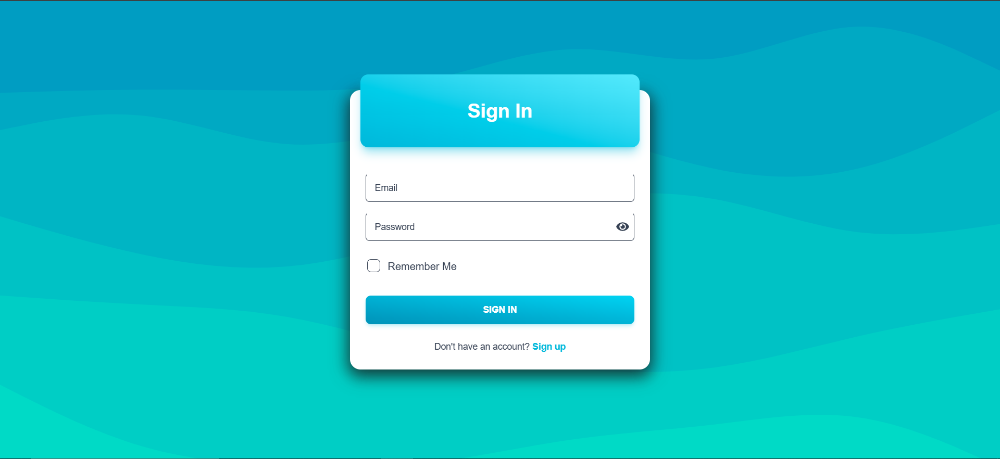
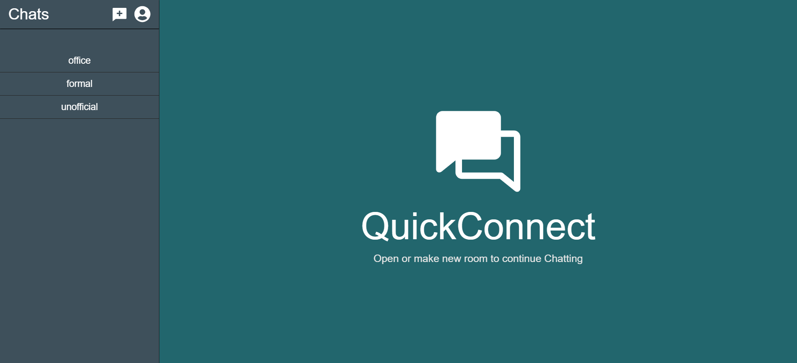

# QuickConnect 💬

QuickConnect is a WebSocket-driven real-time communication platform built using the MERN stack and Socket.IO, enabling seamless room-based messaging with persistent chat history.

---

## 🚀 Features

- 🔐 User authentication with JWT (Register / Login)
- 🏠 Create and join chat rooms
- ⚡ Real-time messaging with Socket.IO
- 📜 Persisted message history via MongoDB
- 🔔 Join/leave room notifications
- 🎨 Responsive UI built with React + Tailwind CSS

---

## 📷 Screenshots

### login Interface


### Rooms Page


### Messaging


---

## 🛠️ Tech Stack

| Layer      | Technology                                                               |
|------------|--------------------------------------------------------------------------|
| Frontend   | React 19, Vite, Redux Toolkit, React Router, Tailwind CSS, Framer Motion |
| Backend    | Node.js, Express 5, Socket.IO                                            |
| Database   | MongoDB (Mongoose)                                                       |
| Auth       | JWT, bcrypt                                                              |
| Validation | Joi                                                                      |

---

## ⚡ Key Engineering Highlights

- Implemented WebSocket-based real-time communication using Socket.IO
- Designed scalable REST APIs with Express.js
- Developed JWT-based authentication & secure password hashing
- Optimized MongoDB schema for message persistence
- Managed complex client-side state using Redux Toolkit

---

## 📁 Project Structure

```
QuickConnect/
├── client/               # React frontend (Vite)
│   ├── src/
│   │   ├── components/   # Reusable UI components
│   │   ├── pages/        # Page-level components
│   │   ├── redux/        # Redux store & slices
│   │   ├── hooks/        # Custom React hooks
│   │   └── utils/        # Utility functions
│   └── package.json
│
└── server/               # Express backend
    ├── routes/           # API routes (auth, users, rooms, messages)
    ├── models/           # Mongoose models (User, Room, Message)
    ├── middleware/       # Auth middleware
    ├── app.js            # Entry point & Socket.IO setup
    └── package.json
```

---

## ⚙️ Getting Started

### Prerequisites

- [Node.js](https://nodejs.org/) (v18+)
- [MongoDB](https://www.mongodb.com/) (local or Atlas)

### 1. Clone the Repository

```bash
git clone https://github.com/Tanuj-Narula/QuickConnect.git
cd QuickConnect
```

### 2. Configure the Server

Create a `.env` file inside the `server/` folder:

```env
PORT=3000
MongoDB_URI=your_mongodb_connection_string
JWT_SECRET=your_jwt_secret_key
```

### 3. Install Dependencies

```bash
# Install server dependencies
cd server
npm install

# Install client dependencies
cd ../client
npm install
```

### 4. Run the Application

Open **two terminals**:

**Terminal 1 – Start the backend:**
```bash
cd server
npm run dev
```

**Terminal 2 – Start the frontend:**
```bash
cd client
npm run dev
```

The frontend will be available at `http://localhost:5173` and the backend at `http://localhost:3000`.

---

## 📡 API Endpoints

| Method | Endpoint         | Description              | Auth Required |
|--------|------------------|--------------------------|---------------|
| POST   | `/auth/register` | Register a new user      | ❌            |
| POST   | `/auth/login`    | Login and receive JWT    | ❌            |
| GET    | `/users`         | Get all users            | ✅            |
| GET    | `/rooms`         | Get all chat rooms       | ✅            |
| POST   | `/rooms`         | Create a new room        | ✅            |

---

## 🔌 Socket.IO Events

| Event            | Direction        | Description                    |
|------------------|------------------|--------------------------------|
| `join_room`      | Client → Server  | Join a specific chat room      |
| `leave_room`     | Client → Server  | Leave a chat room              |
| `sendMessage`    | Client → Server  | Send a message to a room       |
| `receiveMessage` | Server → Client  | Broadcast message to room      |

