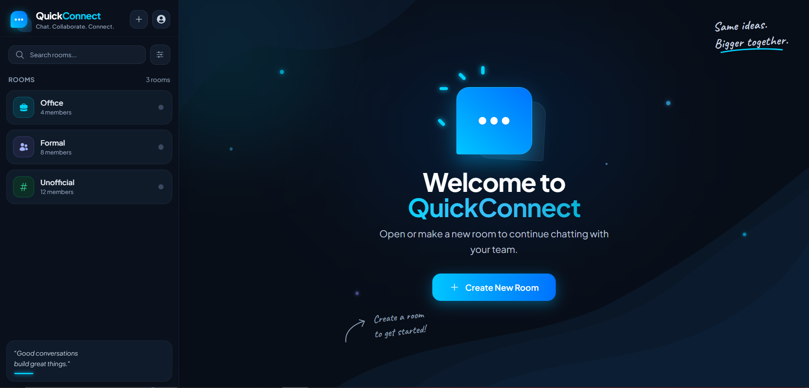
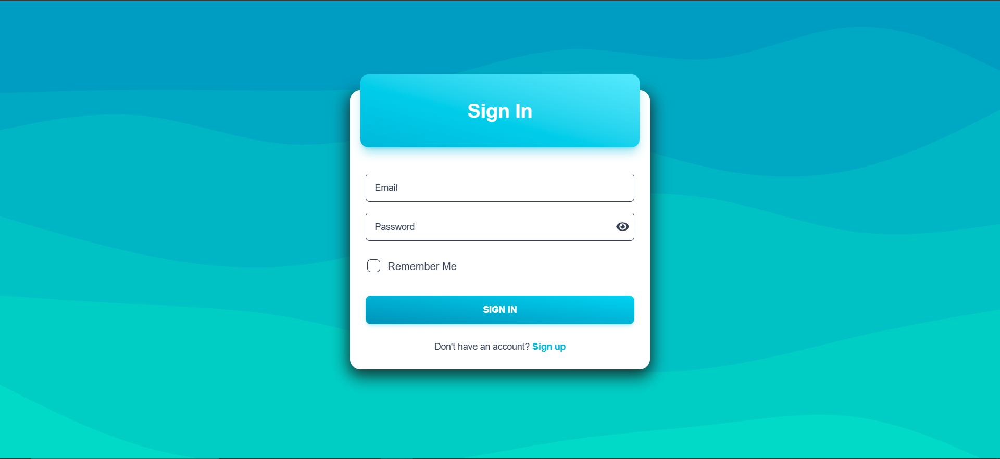
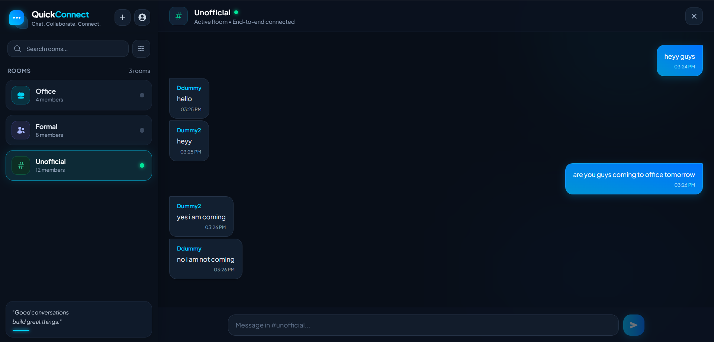

# QuickConnect 💬

QuickConnect is a modern, WebSocket-driven real-time communication platform built using the MERN stack and Socket.IO. Designed with a sleek dark-navy aesthetic, glowing cyan accents, and glassmorphism, it enables seamless room-based messaging with persistent chat history.

---

## 🚀 Features

- 🎨 **Modern Dark UI**: Deep navy background (`#080E18`) with glowing cyan/blue gradients, organic ambient waves, and glassmorphism.
- ✍️ **Custom Typography**: Integrated Google Fonts (`Plus Jakarta Sans` for clean UI & `Caveat` for expressive annotations).
- 🏠 **Smart Rooms & Navigation**:
  - Live room search with instant filtering.
  - Distinct room category badges (Briefcase for Office/Work, Users for Formal/Team, `#` for Channels).
  - Room status indicators (active glowing green dot).
  - Dynamic room counter & bottom quote card.
- 💬 **Interactive Welcome Screen**:
  - 3D glowing speech bubble illustration with celebration sparks radiance.
  - Handwritten slogan (*"Same ideas. Bigger together."*).
  - Hand-drawn pointer arrow & cursive action prompts (*"Create a room to get started!"*).
  - Quick room creation modal.
- ⚡ **Real-Time Messaging**: Instant multi-user messaging powered by Socket.IO with automatic scrolling.
- 📜 **Message Persistence**: Complete chat history stored and retrieved via MongoDB with timestamps.
- 🔐 **Authentication & Profile**:
  - JWT-based registration and login with bcrypt password hashing.
  - "Remember Me" session persistence.
  - Glassmorphic profile menu to update user details, log out, or delete account.

---

## 📷 Screenshots

### Welcome & Rooms Interface


### Login Interface


### Real-Time Chat Section


---

## 🛠️ Tech Stack

| Layer      | Technology                                                                          |
|------------|-------------------------------------------------------------------------------------|
| **Frontend**   | React 19, Vite, Redux Toolkit, React Router 7, Tailwind CSS, Framer Motion, React Icons |
| **Styling**    | Custom CSS, Glassmorphism, Google Fonts (`Plus Jakarta Sans`, `Caveat`)              |
| **Backend**    | Node.js, Express 5, Socket.IO                                                       |
| **Database**   | MongoDB (Mongoose)                                                                  |
| **Auth**       | JSON Web Tokens (JWT), bcrypt                                                       |
| **Validation** | Joi                                                                                 |

---

## ⚡ Key Engineering Highlights

- **Real-Time WebSocket Engine**: Bi-directional event-driven architecture using Socket.IO for room joins, departures, and instant message broadcasts.
- **Global State Management**: Centralized store with Redux Toolkit managing room collections, active room state, and user authentication tokens.
- **Polished UX & Micro-interactions**: Smooth transitions with Framer Motion, hover scale effects, and custom glowing scrollbars.
- **Robust REST API**: Modular Express architecture with route protection middleware and centralized error handling.

---

## 📁 Project Structure

```
QuickConnect/
├── client/                     # React frontend (Vite)
│   ├── src/
│   │   ├── components/         # Reusable UI components (Sidebar, ChatSection, MessageTag, etc.)
│   │   ├── pages/              # Page views (Home, LoginPage)
│   │   ├── redux/              # Redux slices (rooms, singleRoom, user)
│   │   ├── hooks/              # Custom WebSocket hooks (useSocketRoom)
│   │   ├── utils/              # Token expiry & helper utilities
│   │   ├── App.jsx             # Main router & route guards
│   │   ├── index.css           # Tailwind & typography styling
│   │   └── main.jsx            # React root mount
│   └── package.json
│
└── server/                     # Express backend
    ├── routes/                 # REST endpoints (auth, users, rooms)
    ├── models/                 # Mongoose schemas (userModel, roomModel, messageModel)
    ├── middleware/             # JWT auth validation middleware
    ├── config/                 # Database configuration
    ├── app.js                  # Express entry point & Socket.IO server
    └── package.json
```

---

## ⚙️ Getting Started

### Prerequisites

- [Node.js](https://nodejs.org/) (v18+)
- [MongoDB](https://www.mongodb.com/) (local instance or MongoDB Atlas cluster)

### 1. Clone the Repository

```bash
git clone https://github.com/Tanuj-Narula/QuickConnect.git
cd QuickConnect
```

### 2. Configure the Server Environment

Create a `.env` file inside the `server/` folder:

```env
PORT=3000
MongoDB_URI=your_mongodb_connection_string
JWT_SECRET=your_jwt_secret_key
```

### 3. Install Dependencies

```bash
# Install server dependencies
cd server
npm install

# Install client dependencies
cd ../client
npm install
```

### 4. Run the Application

Open **two terminals**:

**Terminal 1 – Start the Backend:**
```bash
cd server
npm run dev
```

**Terminal 2 – Start the Frontend:**
```bash
cd client
npm run dev
```

- **Frontend Application**: `http://localhost:5173`
- **Backend API & Socket**: `http://localhost:3000`

---

## 📡 API Endpoints

### Authentication (`/auth`)
| Method | Endpoint        | Description                          | Auth Required |
|--------|-----------------|--------------------------------------|---------------|
| POST   | `/auth/signup`  | Register a new user account          | ❌            |
| POST   | `/auth/login`   | Authenticate credentials & get JWT   | ❌            |

### Rooms (`/rooms`)
| Method | Endpoint                   | Description                          | Auth Required |
|--------|----------------------------|--------------------------------------|---------------|
| GET    | `/rooms/getall`            | Retrieve all available chat rooms    | ✅            |
| GET    | `/rooms/getone/:id`        | Get specific room details by ID      | ✅            |
| POST   | `/rooms`                   | Create a new chat room               | ✅            |
| GET    | `/rooms/:roomId/messages`  | Fetch message history for a room     | ❌ / ✅       |

### Users (`/users`)
| Method | Endpoint              | Description                          | Auth Required |
|--------|-----------------------|--------------------------------------|---------------|
| GET    | `/users`              | Get authenticated user profile       | ✅            |
| GET    | `/users/:id`          | Get user profile by ID               | ✅            |
| PUT    | `/users/update/:id`   | Update user username/email/password  | ✅            |
| DELETE | `/users/:id`          | Delete user account                  | ✅            |

---

## 🔌 Socket.IO Events

| Event            | Direction        | Payload / Description                         |
|------------------|------------------|-----------------------------------------------|
| `join_room`      | Client → Server  | `{ roomId }` – Join a specific room channel   |
| `leave_room`     | Client → Server  | `{ roomId }` – Leave the current chat room    |
| `sendMessage`    | Client → Server  | `{ text, room_id, user_id }` – Send message  |
| `receiveMessage` | Server → Client  | Broadcasts message object to all room members |


